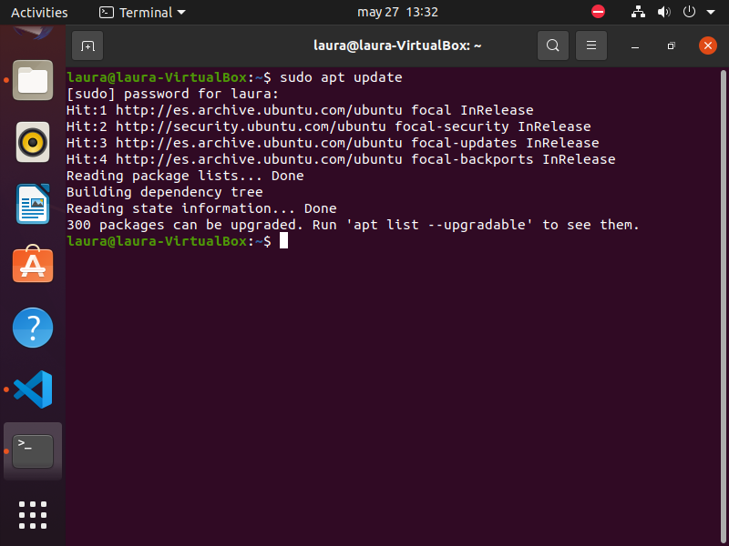
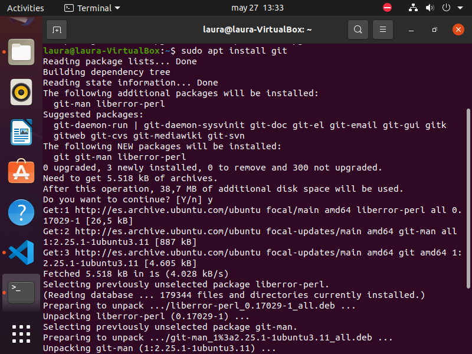
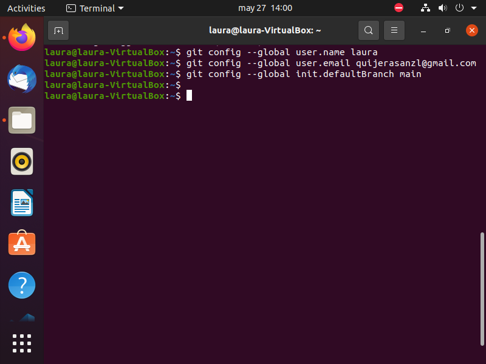
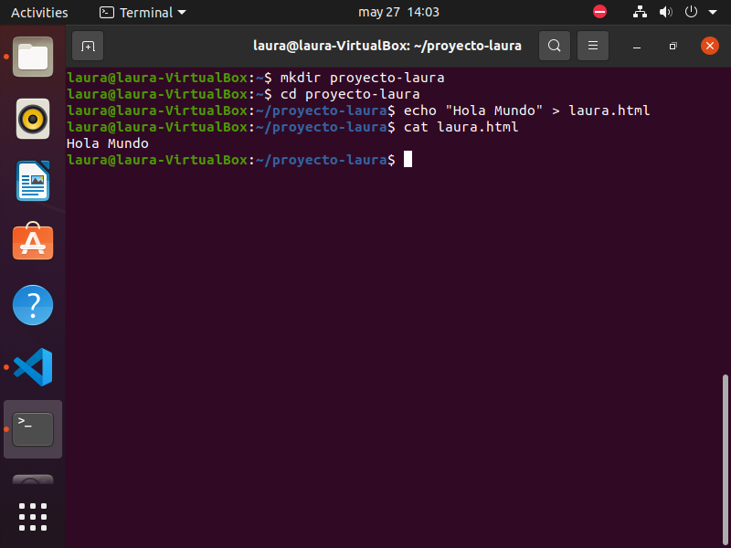
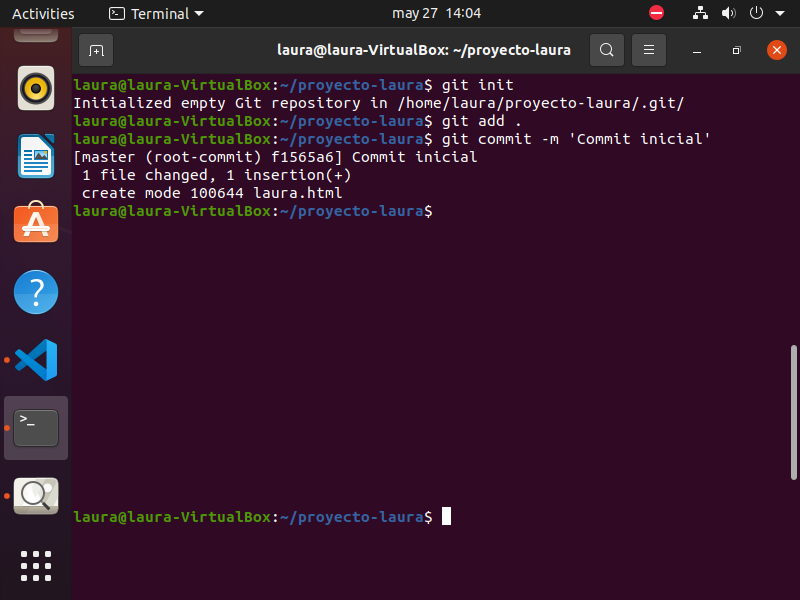

# TRABAJO FINAL GIT

## Porqué usar GITHUB?

Github nos facilita la colaboración entre equipos, haciendo que varios colaboradores trabajen en el mismo trabajo sin problemas.
Github integra unas herramientas para serguir y corregir los errores 

## Instalación de GIT 

El primer paso para instalar GIT es abrir la consola de ubuntu y poner el siguiente comando 

- *sudo apt update*

- *sudo apt install git*

Para configurar git estos serán los siguientes comandos que vamos a ejecutar 
- *git conifg --global user.name "laura" *

en la parte de name se escribe el nombre que quieras ponerle a tu configuración 

- *git config --global user.email "tu.email@ejemplo.com"*

- *gitconfig --global init.defaultBranch main * 

(en este caso la última palabra depende si tenemos main o master)

## Creción del Proyecto

Para crear un proyecto lo primero que vamos a hacer es crear una carpeta 
- *mkdir proyecto-laura*

Nos movemos a nuestra carpeta 
- *cd proyecto-laura*
- *echo "console.log(Hola Mundo);" > index.js*

## Inicializar GIT 

Para iniciar git el primer comando que debemos poner en la consola es el siguiente 
- *git init*

(Esto hace que iniciemos un nuevo repositorio en Git en la carpeta de nuestro proyecto)

Para finalizarlo vamos a preparar todos los archivos del proyecto para el proximo commit 
- *git add .*

vamos a crear un commit 
- *git commit -m 'Commit inicial: Añadido index.js con console.log'*

